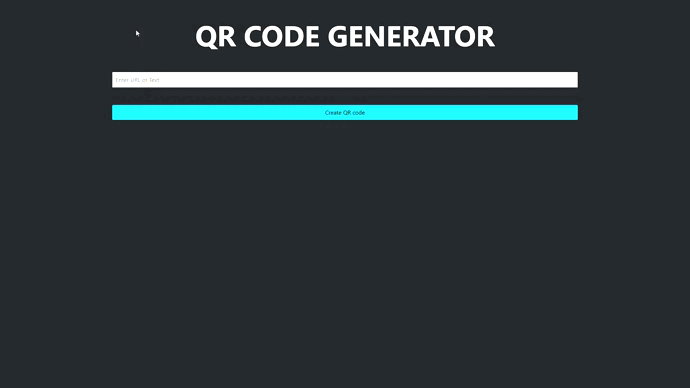

# QRcode-Generator

## **If you want to run the project on your machine, follow the step by step below:**
##  In the terminal, clone the project:
       git clone: https://github.com/anastaciom/QRcode-Generator.git

## Enter the project folder:
        cd QRcode-Generator

##  Install the dependencies:
        npm install

*Dependencies:*
- ***EJS***
- ***Express***
- ***QRcode***
## Run the application:
        node app.js

### Okay, now it is possible to access the application from the route: http://localhost:3000/

---
## Project working:

